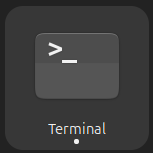

# SSH Login to INFO090 Cluster

This short guide shows how to log into the INFO090 HPC cluster using SSH from your terminal.

## 1. What you need

- A INFO090 account (`yourUsername`)
- A terminal:
    - **Linux/macOS:** built-in Terminal app

        
    
    - **Windows:** CMD, PowerShell, or better, Windows Terminal (recommended)

        


## 2. Basic SSH login


The basic command to log in is:

```bash
ssh <USERNAME>@<HOSTNAME>
```

Therefore, for INFO090, it is:

```bash
ssh yourUsername@143.106.73.68
```

On first login, you may see a host key check. Type `yes` and press `Enter`.

Then it will be prompted for a password, type it and press `Enter`. **Note:** nothing is shown while typing passwords.

## 3. Verify you are on the remote machine

After login into INFO090, run:

```bash
hostname
pwd
```

These commands confirm which machine you are on and what is in your remote home directory. You should see an output like:

```
headnode.novalocal
/home/yourUsername
```

## 4. Authentication with SSH keys (optional)

If you want to avoid typing your password each time, you can use SSH keys. Keys are more secure and are often required on HPC systems.

Generate a key pair locally:

```bash
ssh-keygen -t ed25519 -f ~/.ssh/id_ed25519
```

- Keep `~/.ssh/id_ed25519` private
- Share only `~/.ssh/id_ed25519.pub`

Copy the public key to INFO090:

```bash
ssh-copy-id -i ~/.ssh/id_ed25519.pub yourUsername@143.106.73.68
```
After this, you can log in without a password:

```bash
ssh yourUsername@143.106.73.68
```

## 5. Common issues

- `Permission denied`: check username/host/port, and whether your key is installed on the cluster.
- `Connection timed out`: verify VPN/network access and cluster availability.
- Wrong prompt confusion: check `hostname` to confirm local vs remote shell.

## 6. Logout

When done:

```bash
logout
```

## 7. Further reading

- Connecting to a remote HPC system: https://carpentries-incubator.github.io/hpc-intro/11-connecting.html
- SSH key authentication: https://www.ssh.com/ssh/keygen/
