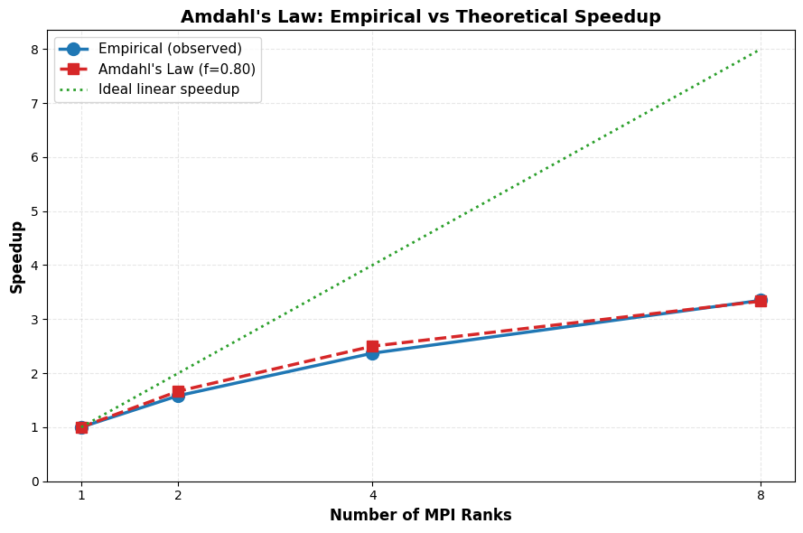

# Amdahl's Law example with Slurm and MPI

This guide demonstrates **Amdahl's Law** in practice by running the `amdahl` MPI package on the INFO090 cluster. The `amdahl` package simulates a realistic workload with a **fixed serial fraction** (non-parallelizable code) and a **variable parallel portion**. By measuring execution time across different core counts, you will observe how Amdahl's Law limits speedup despite increasing parallelism.

## Prerequisites

- Login access to INFO090 cluster
- Basic familiarity with Slurm and Lmod (covered in the previous guides)

## 1. Installation and Setup

### 1.1 Load required modules

Load the Python interpreter and MPI implementation needed by `amdahl`:

```bash
module load mpich
module load python/3.13.1
```

### 1.2 Create a virtual environment

Create and activate a dedicated virtual environment to keep dependencies isolated:

```bash
python3 -m venv amdahl-env
source amdahl-env/bin/activate
```

### 1.3 Install the `amdahl` package

With the environment active, install via pip:

```bash
pip install amdahl
```

### 1.4 Verify installation

Test the installation:

```bash
amdahl --help
```

You should see the `amdahl` command options. You are now ready to run jobs.


## 2. Running a Serial Test (1 MPI rank)

To establish a baseline, run the `amdahl` program with a single MPI rank.

### 2.1 Create a submit script

Save the following as `run_amdahl_serial.sh`:

```bash
#!/bin/bash
#SBATCH -J serial-amdahl
#SBATCH -p cpu
#SBATCH -n 1
#SBATCH --time=00:05:00
#SBATCH -o amdahl-serial-%j.out

module load python/3.13.1
module load mpich

source amdahl-env/bin/activate

amdahl
```

### 2.2 Submit and monitor

Submit the job:

```bash
sbatch run_amdahl_serial.sh
```

Check job status:

```bash
squeue --me
```

### 2.3 Review the output

Once the job completes, check the output file (e.g., `amdahl-serial.out`):

```bash
cat amdahl-serial.out
```

You should see output like:

```txt
Doing 30.000000 seconds of 'work' on 1 processor,
 which should take 30.000000 seconds with 0.800000 parallel proportion of the workload.

  Hello, World! I am process 0 of 1 on node-1.novalocal. I will do all the serial 'work' for 6.859674 seconds.
  Hello, World! I am process 0 of 1 on node-1.novalocal. I will do parallel 'work' for 28.613068 seconds.

Total execution time (according to rank 0): 35.508335 seconds
```

**Key observations:**
- Total work duration: ~30 seconds
- Serial fraction: ~6 seconds (20%)
- Parallel fraction: ~24 seconds (80%)


## 3. Running Parallel Tests (2, 4, 8 MPI ranks)

Now test how execution time scales with more ranks.

### 3.1 Parallel with 2 ranks

Create `run_amdahl_parallel_2.sh`:

```bash
#!/bin/bash
#SBATCH -J parallel-amdahl-2
#SBATCH -p cpu
#SBATCH -n 2
#SBATCH --time=00:05:00
#SBATCH -o amdahl-parallel-2.out

# Load modules
module load python/3.13.1
module load mpich

# Activate our virtualenv
source amdahl-env/bin/activate

# Run amhdahl with 2 cores (inherit slurm config)
mpirun amdahl
```

Submit and inspect the output:

```bash
sbatch run_amdahl_parallel_2.sh
```

Expected output will include:

```txt
Total execution time (according to rank 0): 20.423892 seconds
```

Notice the time dropped from ~30s (1 rank) to ~20s (2 ranks) — a speedup of ~1.5×.

### 3.2 Parallel with 4 and 8 ranks

Repeat the process for 4 and 8 ranks:

```bash
# For 4 ranks, change -n 2 to -n 4 in the script above
sbatch run_amdahl_parallel_4.sh

# For 8 ranks, change -n 2 to -n 8 in the script above
sbatch run_amdahl_parallel_8.sh
```

**Observations:**
- With 4 ranks: execution time decreases further, but speedup is less than 4x (limited by serial work).
- With 8 ranks: speedup continues to diminish, approaching the theoretical Amdahl's Law limit.

## 4. Automated Sweep and Plot

To systematically measure speedup across multiple rank counts and visualize Amdahl's Law, 
use the provided automation scripts.

### 4.1 Files provided

Two helper scripts are included in this folder:

- **`submit_amdahl_sweep.sh`** — Submits 4 Slurm jobs (1, 2, 4, 8 ranks); each runs 3 times for averaging.
- **`parse_plot_amdahl.py`** — Extracts timing data and plots empirical speedup vs theoretical prediction.

### 4.2 Prerequisites

Ensure you have completed section 1 (Installation and Setup). The sweep script will 
auto-activate the virtual environment and install any missing dependencies.

### 4.3 Run the automated sweep

Execute the sweep script from the folder containing both scripts:

```bash
bash submit_amdahl_sweep.sh
```

This will:
1. Verify the virtual environment and install packages if needed
2. Submit 4 Slurm jobs (one for each rank count)
3. Run each job 3 times and average the results
4. Save outputs to the `amdahl_results/` directory

Monitor job progress with:

```bash
squeue --me
```

### 4.4 Parse outputs and generate plot

Once all jobs complete, run the parser and plotter:

```bash
source amdahl-env/bin/activate
python3 parse_plot_amdahl.py
```

This will:
- Extract execution times from `amdahl_results/amdahl_*.txt`
- Calculate empirical speedup relative to the 1-rank baseline
- Compute theoretical Amdahl's Law speedup (automatically detected from output)
- Save a plot as `amdahl_speedup.png`
- Print a summary table of results

The generated plot will look like this:




The summary table will show something like:

```txt
============================================================
Ranks    Time (s)     Empirical    Theoretical  Ideal   
------------------------------------------------------------
1        33.4190      1.000        1.000        1.000   
2        20.3490      1.642        1.667        2.000   
4        12.2822      2.721        2.500        4.000   
8        9.8324       3.399        3.333        8.000   
============================================================
```

### 4.5 Interpreting the results

The generated plot shows three curves:

- **Empirical (blue, circles)** — Observed speedup from your actual runs
- **Amdahl's Law (red, squares)** — Theoretical prediction (e.g., f=0.8 for 80% parallel)
- **Ideal linear (green, dotted)** — Perfect speedup (not achievable due to serial work)

**Key insights:**
- The empirical curve typically tracks the Amdahl's Law prediction, confirming the theory.
- Speedup plateaus as the serial portion dominates; increasing cores beyond ~4-8 shows diminishing returns.
- The gap between empirical and ideal illustrates the cost of serialization.

