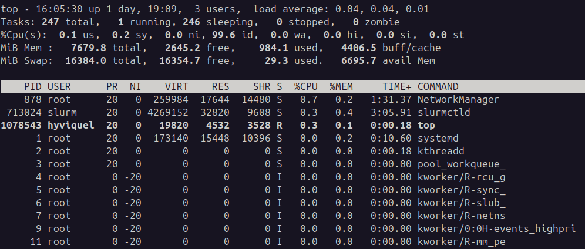
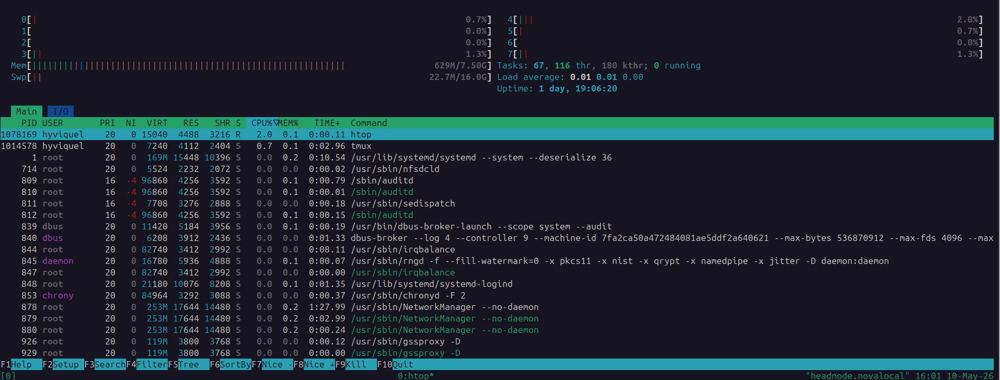
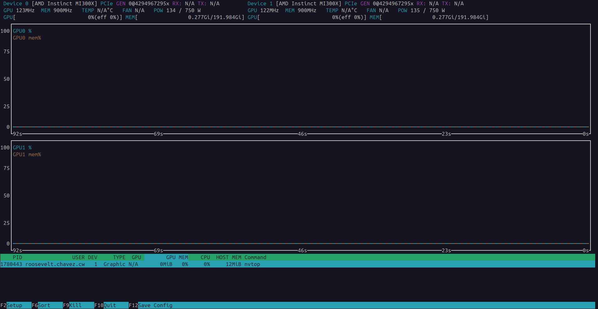

# Checking Hardware on HPC Clusters

This guide shows how to inspect and monitor hardware on HPC clusters using command-line tools. You will learn how to check CPU and GPU specifications, monitor system resources in real time, and diagnose hardware capabilities. By the end, you will be able to quickly assess what hardware is available on a compute node.

## Quick Cheat Sheet

| Task | Command |
|---|---|
| CPU information | `lscpu` |
| PCI devices (GPUs, etc.) | `lspci` |
| Top processes by CPU/memory | `top` |
| Interactive process monitor | `htop` |
| GPU monitoring | `nvtop` |
| GPU monitoring (AMD ROCm) | `amd-smi` |
| GPU monitoring (NVIDIA CUDA) | `nvidia-smi` |

## Why Check Hardware?

Before running a program on an HPC cluster, you want to understand what hardware you're actually using:
- **CPU cores and architecture:** Affects parallelism and optimization
- **Memory:** Determines maximum problem size
- **GPUs:** Critical for accelerated computing
- **Real-time usage:** Helps debug performance issues

## 1. CPU Information with `lscpu`

`lscpu` displays detailed CPU architecture information.

### Basic usage

```bash
lscpu
```

You will see output like:

```
Architecture:                x86_64         
  CPU op-mode(s):            32-bit, 64-bit                                                    
  Address sizes:             46 bits physical, 48 bits virtual
  Byte Order:                Little Endian
CPU(s):                      4           
  On-line CPU(s) list:       0-3                                                               
Vendor ID:                   GenuineIntel                                                                                                                                                     
  Model name:                Intel(R) Xeon(R) CPU E5-2620 v2 @ 2.10GHz                                                                                                                        
    CPU family:              6           
    Model:                   62          
    Thread(s) per core:      1           
    Core(s) per socket:      1           
    Socket(s):               4                                                                                                                                                                
    Stepping:                4
    BogoMIPS:                4199.99
    Flags:                   fpu vme de pse tsc msr pae mce cx8 apic sep mtrr pge mca cmov pat pse36 clflush mmx fxsr sse sse2 ss syscall nx pdpe1gb rdtscp lm constant_tsc arch_perfmon rep_g
                             ood nopl xtopology cpuid tsc_known_freq pni pclmulqdq vmx ssse3 cx16 pcid sse4_1 sse4_2 x2apic popcnt tsc_deadline_timer aes xsave avx f16c rdrand hypervisor lah
                             f_lm pti ssbd ibrs ibpb stibp tpr_shadow flexpriority ept vpid fsgsbase tsc_adjust smep erms xsaveopt arat vnmi md_clear

...
```

### Interpreting the output

- **CPU(s):** Total number of logical CPUs (threads)
- **Model name:** Processor model (Intel Xeon, AMD EPYC, etc.)
- **CPU max MHz / CPU min MHz:** Clock speed range
- **Caches:** L1, L2, L3 cache sizes (larger = better for performance)
- **Flags:** Supported CPU instructions (look for `avx`, `avx512`, `svm` for virtualization)

### Useful flags

To see only specific information:

```bash
# Count physical cores
lscpu | grep "^Core(s)"

# Count NUMA nodes (if applicable)
lscpu | grep "NUMA node"

# Show CPU flags
lscpu | grep "Flags"
```

## 2. PCI Devices with `lspci`

`lspci` lists all PCI devices attached to the system, including GPUs, NICs, and storage controllers.

### Basic usage

```bash
lspci
```

You will see output like:

```
00:00.0 Host bridge: Intel Corporation 440FX - 82441FX PMC [Natoma] (rev 02)
00:01.0 ISA bridge: Intel Corporation 82371SB PIIX3 ISA [Natoma/Triton II]
00:01.1 IDE interface: Intel Corporation 82371SB PIIX3 IDE [Natoma/Triton II]
00:01.2 USB controller: Intel Corporation 82371SB PIIX3 USB [Natoma/Triton II] (rev 01)
00:01.3 Bridge: Intel Corporation 82371AB/EB/MB PIIX4 ACPI (rev 03)
00:02.0 VGA compatible controller: Cirrus Logic GD 5446
00:03.0 Ethernet controller: Red Hat, Inc. Virtio network device
00:04.0 SCSI storage controller: Red Hat, Inc. Virtio block device
00:05.0 Unclassified device [00ff]: Red Hat, Inc. Virtio memory balloon
```

### Filtering for GPUs

To see only GPUs:

```bash
lspci | grep -i "VGA\|3D\|Display"
```

Output example (AMD GPUs):

```
00:08.0 Display controller: Advanced Micro Devices, Inc. [AMD/ATI] Aqua Vanadium [Instinct MI300X]
00:09.0 Display controller: Advanced Micro Devices, Inc. [AMD/ATI] Aqua Vanadium [Instinct MI300X]
```


Output example (NVIDIA GPUs):

```
83:00.0 VGA compatible controller: NVIDIA Corporation GA102 [GeForce RTX 3090]
84:00.0 VGA compatible controller: NVIDIA Corporation GA102 [GeForce RTX 3090]
```

### Detailed information

For more details about a specific device:

```bash
lspci -v -s <SLOT>
```

For example, to see details about the GPU at slot `83:00.0`:

```bash
lspci -v -s 83:00.0
```


### Practice 

Now, create a job in a GPU node to execute `lspci` and find the GPU model:

```bash
srun -p gpu lspci
```

## 3. Real-Time Process Monitoring with `top`

`top` displays a dynamic view of system CPU usage, memory, and running processes.

### Basic usage

```bash
top
```

You will see a screen with:



### Interpreting the output

**Top section:**
- **load average:** System load (1 = fully busy, >1 = overloaded)
- **Tasks:** Total, running, sleeping processes
- **%Cpu(s):** user %, system %, idle %
- **MiB Mem:** Total, free, used memory
- **MiB Swap:** Swap space

**Process list:**
- **%CPU:** CPU usage percentage
- **%MEM:** Memory usage percentage
- **TIME+:** Total CPU time used by the process
- **COMMAND:** Name of the command

### Common interactive commands

Inside `top`, you can press:

- `q` to quit
- `1` to show CPU per core
- `M` to sort by memory usage
- `P` to sort by CPU usage
- `h` to see help

### Exit top

Press `q` to quit.


### Practice

Now, create an interactive job and execute `top` inside:

```bash
srun --pty bash
top
```

## 4. Interactive Process Monitor with `htop`

`htop` is a more user-friendly alternative to `top` with scrolling and better visualization.

### Basic usage

```bash
htop
```

You will see a color-coded display:



### Key advantages over `top`

- Color-coded bars for CPU and memory
- Scrollable process list (arrow keys)
- Per-core CPU visualization
- Better organized columns
- Kill and suspend processes with F9 and F17

### Common interactive commands

- Arrow keys: scroll up/down or move selection
- `F3` (or `/`) to search for a process
- `F6` to sort by different columns
- `F9` to kill a process
- `F10` to quit
- `k` to send a signal to a process


### Practice 
Now, create an interactive job and execute `htop` inside:

```bash
srun --pty bash
htop
```

## 5. GPU Monitoring with `nvtop`

`nvtop` is a top-like tool specifically designed for GPU monitoring on Intel, AMD or NVIDIA systems.

### Basic usage

```bash
nvtop
```

You will see GPU utilization, memory, and temperature in real time:



### Interpreting the output

**GPU Status:**
- **Utilization %:** Percentage of GPU compute units in use
- **Frequency (MHz):** Current GPU clock speed
- **Temperature (°C):** GPU junction temperature
- **Power:** Current power draw in watts

**Memory:**
- **Used / Total:** GPU memory usage

**Processes:**
- Shows which processes are using each GPU

### Interactive commands

- Arrow keys: scroll or select process
- `q` to quit
- `e` to expand/collapse details
- `k` to kill a process

### Practice 

Now, create an interactive job on a GPU node and execute `nvtop` inside:

```bash
srun -p gpu --pty bash
nvtop
```

## 6. GPU Monitoring with `amd-smi` (AMD ROCm)

`amd-smi` (AMD System Management Interface) is the official tool for monitoring and managing AMD GPU devices. It provides real-time data on power, temperature, and utilization for AMD Instinct accelerators.

### Basic usage

To see the current status of all GPUs on a node:

```bash
amd-smi
```

You will see an output similar to this:

```text
+--------------------------------------------------------------------------------------------+
| AMD-SMI 26.2.1+fc0010cf6a      amdgpu version: 6.16.13    ROCm version: 7.2.0              |
+------+-----------+----------+----------------+---------+---------+-----+-------------------+
| BDF  |           |          | GPU-Name       | Mem-Uti | Temp    | UEC |       Power-Usage |
| GPU  | HIP-ID    | OAM-ID   | Partition-Mode | GFX-Uti | Fan     |     |         Mem-Usage |
+======+===========+==========+================+=========+=========+=====+===================+
| 0000:00:08.0     |          | AMD Instinct MI300X | 0 % | 42 °C  | 0   |         134/750 W |
|    0 |         0 |        4 |       SPX/NPS1 | 0 %     | N/A     |     |     283/196592 MB |
+------+-----------+----------+----------------+---------+---------+-----+-------------------+
```

### Interpreting the output

**Header:**

* **AMD-SMI / ROCm version:** The version of the management tool and the ROCm software stack.
* **amdgpu version:** The version of the Linux kernel driver.

**GPU Table:**

* **BDF / GPU:** The PCI Bus Identifier (e.g., `00:08.0`) and the software GPU index (`0`).
* **GPU-Name:** The model of the card (e.g., **Instinct MI300X**).
* **GFX-Uti / Mem-Uti:** Percentage of the GPU cores (Graphics) and Memory controllers currently in use.
* **Temp:** The current temperature of the GPU die in Celsius.
* **Power-Usage:** Current power draw / Maximum power capacity (TDP).
* **Mem-Usage:** Current Video RAM (VRAM) used / Total VRAM available. Note the MI300X has nearly 192GB (196,592 MB) of HBM3 memory.


### Continuous Monitoring

To watch your GPU usage in real-time while a job is running, use the `watch` command (standard in Linux) or the built-in interval:

```bash
# Updates every 1 second
watch -n 1 amd-smi
```

### Practice 

Now, create an interactive job on a GPU node and execute `amd-smi` inside:

```bash
srun -p gpu --pty bash
amd-smi
```

## 6. GPU Monitoring with `nvidia-smi` (NVIDIA CUDA)

`nvidia-smi` (NVIDIA System Management Interface) displays NVIDIA GPU information and real-time monitoring.

### Basic usage

```bash
nvidia-smi
```

You will see:

```
+-----------------------------------------------------------------------------+
| NVIDIA-SMI 545.23.06    Driver Version: 545.23.06    CUDA Version: 12.2     |
|---------|-----|-----|
| GPU  Name        Persistence-M| Bus-Id        Disp.A | Volatile Uncorr. ECC |
| Fan  Temp  Perf   Pwr:Usage/Cap|         Memory-Usage | GPU-Util  Compute M. |
|=========|=====|=====|
|   0  NVIDIA RTX A100   Off  | 00:1E.0     Off |                  Off |
| 30%   42C    P0    89W / 250W |   8234MiB / 40960MiB |     45%      Default |
|   1  NVIDIA RTX A100   Off  | 00:1F.0     Off |                  Off |
| 28%   38C    P0    72W / 250W |   5120MiB / 40960MiB |     28%      Default |
+----------------------------------------------+
```

### Interpreting the output

**Header:**
- **CUDA Version:** Supported CUDA version
- **Driver Version:** NVIDIA driver version

**GPU table:**
- **GPU:** GPU index (0, 1, etc.)
- **Temp:** GPU temperature in Celsius
- **Perf:** Power state (P0 = high performance, P8 = low power)
- **Pwr:Usage/Cap:** Current power draw / maximum power
- **Memory-Usage:** Used / Total GPU memory
- **GPU-Util:** GPU utilization percentage

### Continuous monitoring

To monitor GPU usage continuously:

```bash
nvidia-smi -l 1
```

This updates every 1 second. Use other intervals like `-l 2` for 2 seconds, etc.


## Summary

| Tool | Purpose | Best For |
|---|---|---|
| `lscpu` | CPU specifications | Understanding CPU architecture |
| `lspci` | PCI devices list | Finding GPUs and NICs |
| `top` | Process monitoring | Quick system overview |
| `htop` | Interactive monitoring | User-friendly monitoring |
| `nvtop` | General GPU monitoring | Real-time GPU stats |
| `amd-smi` | AMD GPU monitoring | Real-time GPU stats (ROCm) |
| `nvidia-smi` | NVIDIA GPU monitoring | Real-time GPU stats (CUDA) |

Now you can quickly assess hardware capabilities on any HPC cluster node!