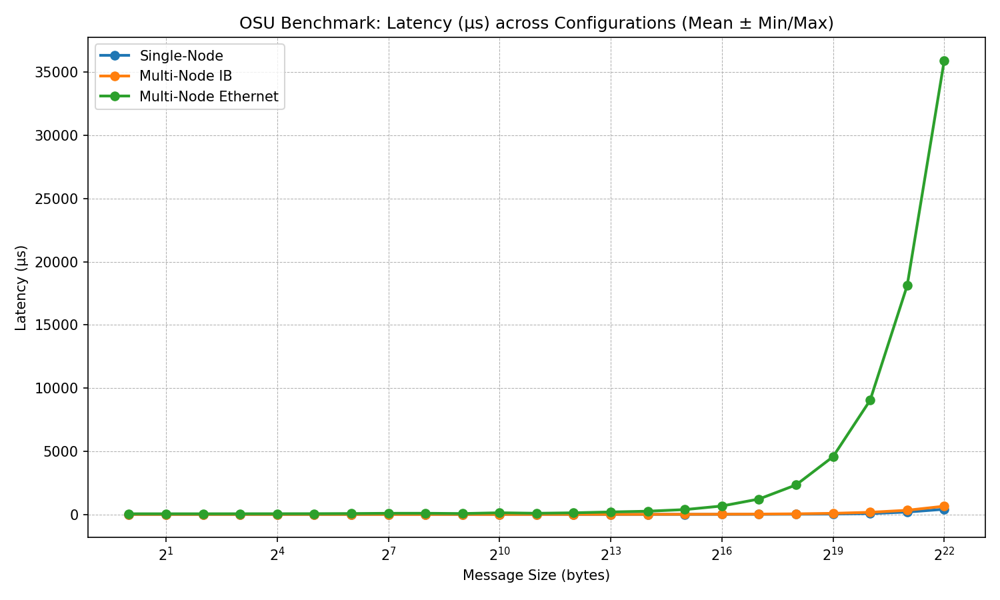
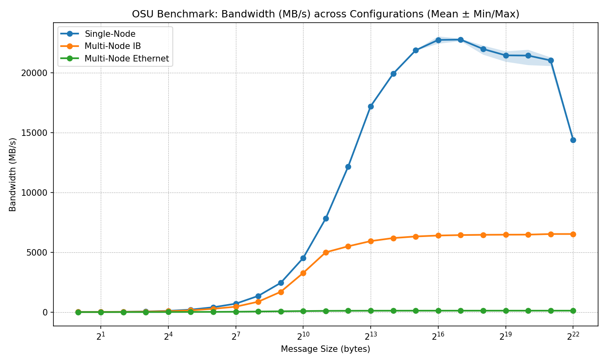

# Assessing latency and bandwidth performance with OSU microbenchmarks

In the [previous day](../../01-hpc-intro/README.md) you learned the basics for accessing a cluster, transferring files, and running simple MPI programs. In this guide, we will use all the skills you learned to assess the communication performance of a cluster using the [OSU MicroBenchmarks Suite](https://mvapich.cse.ohio-state.edu/benchmarks/). These benchmarks are widely used in HPC to measure latency and bandwidth of MPI communication.

## Preliminaries
- Log in to the INFO090 cluster
- Complete the [01-hpc-intro](../../01-hpc-intro/README.md) guides to understand the basics of cluster access, file transfer, and job submission.


## 1. Verify binaries and environment

Load the OSU microbenchmarks and MPICH modules:

```bash
module load osu-micro-benchmarks
module load mpich
```

Now, to ensure the `osu_latency` and `osu_bw` binaries are available:

```bash
which osu_latency osu_bw
```

You should see the paths to these executables.

```txt
/opt/ohpc/pub/apps/spack/local/linux-ivybridge/osu-micro-benchmarks-7.5-v334cgg576whj57lqme7zfi3l7ucp6aj/libexec/osu-micro-benchmarks/mpi/pt2pt/osu_latency
/opt/ohpc/pub/apps/spack/local/linux-ivybridge/osu-micro-benchmarks-7.5-v334cgg576whj57lqme7zfi3l7ucp6aj/libexec/osu-micro-benchmarks/mpi/pt2pt/osu_bw
```

## 2. Measuring latency with `osu_latency`

The `osu_latency` benchmark measures the round-trip time (latency) for messages of varying sizes between two MPI ranks. Latency is a critical metric for applications that require frequent communication, such as those in scientific simulations and real-time data processing. 

Let's create a Slurm submission script `submit_osu_latency.sh` with the following content:

```bash
#!/bin/bash
#SBATCH --job-name=osu-latency
#SBATCH --nodes=1
#SBATCH --ntasks=2
#SBATCH --output=osu_latency.out

module load mpich || true
module load osu-micro-benchmarks || true

mpirun -np 2 osu_latency
```

Submit the job with `sbatch submit_osu_latency.sh`. When the job completes you will have a `osu_latency.out` file with the results.

```txt
# OSU MPI Latency Test v7.5
# Datatype: MPI_CHAR.
# Size       Avg Latency(us)
1                       0.29
2                       0.29
4                       0.29
8                       0.29
16                      0.31
32                      0.31
64                      0.33
128                     0.36
256                     0.42
512                     0.59
1024                    0.69
2048                    1.98
4096                    4.19
8192                    3.60
16384                   4.41
32768                   7.26
65536                  11.11
131072                 18.90
262144                 35.04
524288                 66.23
1048576               130.35
2097152               262.64
4194304              1076.25
```


## 3. Measuring bandwidth with `osu_bw`

Now, we will measure the bandwidth using the `osu_bw` benchmark, which evaluates the data transfer rate (throughput) between two MPI ranks for varying message sizes. Bandwidth is crucial for applications that transfer large volumes of data, such as those in machine learning training and large-scale simulations.

Let's create a Slurm submission script `submit_osu_bw.sh` with the following content:

```bash
#!/bin/bash
#SBATCH --job-name=osu-bw
#SBATCH --nodes=1
#SBATCH --ntasks=2
#SBATCH --output=osu_bw.out

module load mpich || true
module load osu-micro-benchmarks || true

mpirun -np 2 osu_bw
```
Submit the job with `sbatch submit_osu_bw.sh`. When the job completes you will have a `osu_bw.out` file with the results.

```txt
# OSU MPI Bandwidth Test v7.5
# Datatype: MPI_CHAR.
# Size      Bandwidth (MB/s)
1                       6.56
2                      13.31
4                      26.43
8                      54.20
16                    108.16
32                    207.98
64                    307.81
128                   422.73
256                   727.77
512                  1545.97
1024                 2659.40
2048                 1768.17
4096                 4314.85
8192                 6506.38
16384                8344.00
32768                8899.51
65536                9001.83
131072               8916.30
262144               9091.65
524288               9209.64
1048576              5737.98
2097152              9223.34
4194304              9321.61
```

## 4. Plotting and analyzing results

Now you have the tools to run the benchmarks repeatedly and produce robust visualizations and statistics. To do so we have provided an all-in-one submission script [submit_all_osu.sh](scripts/submit_all_osu.sh) that runs three trials, and saves raw outputs into a results directory.

Execute the `submit_all_osu.sh` script with:

```bash
bash scripts/submit_all_osu.sh
```

The submitted jobs may take some time to complete because it runs several trials. You can monitor the job status with `squeue`. When the job finishes, you can use the `aggregate_osu_results.py` script to process the results.

To aggregate latency results and generate a plot, run:

```bash
# Activate the Python environment if you haven't already
source osu-env/bin/activate
python3 scripts/aggregate_osu_results.py --type latency
```

This command reads the latency files in the results directory, computes mean/std/min/max across trials per message size, and writes a comparison plot and a CSV summary into the same results directory.



As you can see from the plot, the latency remains relatively flat for small message sizes (1-128 bytes) at around 0.3 microseconds, which is typical for intra-node communication. As message size increases beyond 256 bytes, latency starts to rise due to increased transmission time and buffering overhead. 

Now, to aggregate bandwidth results and generate a plot, run:

```bash
python3 scripts/aggregate_osu_results.py --type bw
```


In the bandwidth plot, we see that bandwidth increases rapidly with message size up to around 64 kB, where it peaks at around 9 GB/s. This is likely the maximum bandwidth of the interconnect for large messages. For smaller messages, bandwidth is much lower due to latency dominating the communication time. 

## 5. What about inter-node performance?

In this guide, we have measured the performance of two MPI ranks running on the same node. We did this because our cluster is a **virtualized environment** where all compute nodes are actually virtual machines running on the same physical host (with the exception of the GPU node). This means that even if you run two MPI ranks on different "nodes", they are still communicating through the same physical network interface; thus, you won't see a significant difference in latency or bandwidth compared to running both ranks on the same node. However, in a real multi-node cluster, you would have different communication interfaces (e.g., Ethernet, InfiniBand) that can significantly impact performance.

To give you an example, below is a plot of latency and bandwidth results from a real HPC cluster comparing Single-Node versus Multi-Node performance over Ethernet and InfiniBand interfaces. The results clearly show that both Single-Node and InfiniBand connections achieve significantly lower latency than standard Ethernet. Regarding throughput, while InfiniBand offers a substantial bandwidth advantage over Ethernet, it still cannot match the peak speeds of Single-Node communication. This comparison highlights a critical bottleneck in High-Performance Computing: the network fabric often limits the scalability of distributed applications. To address this, modern technologies such as RDMA (Remote Direct Memory Access) and NVLink have emerged, bypassing traditional protocol overhead to provide near-memory speeds for inter-node data exchange.


