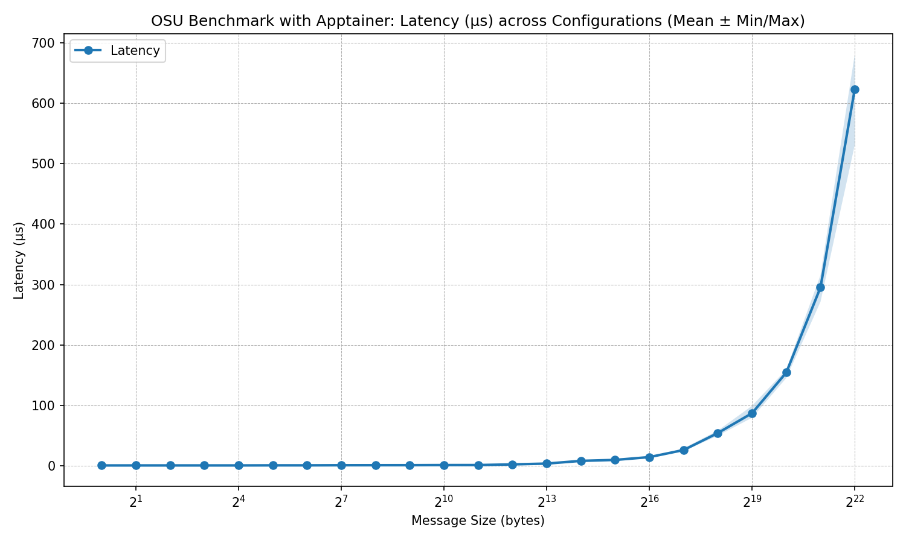
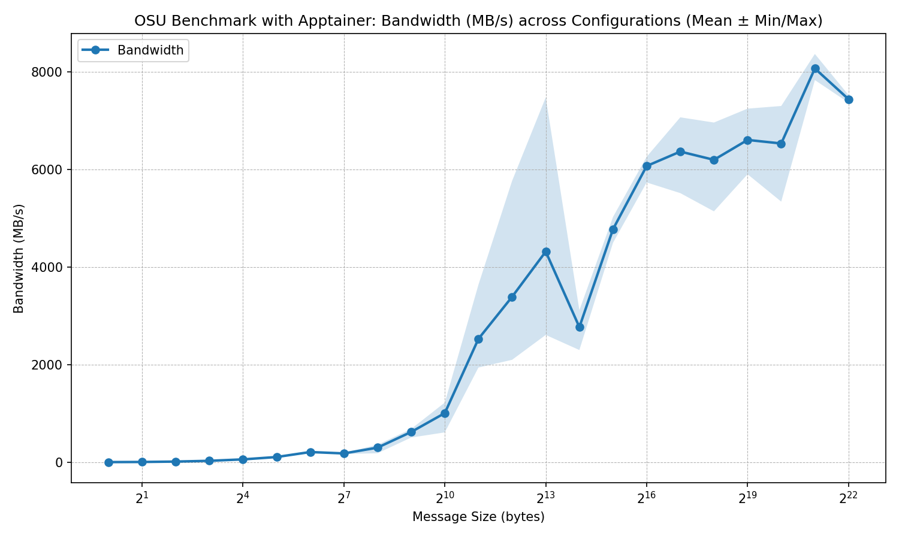

# OSU Micro-Benchmarks with Apptainer

In a previous guide, we launched OSU micro-benchmarks directly on the INFO090 HPC cluster. In this guide, we run them inside an Apptainer container. This helps ensure a consistent software environment and makes it easier to test containerized HPC workflows.

## 1. Create a Container with OSU Benchmarks

First, create an Apptainer container image with OSU Micro-Benchmarks and InfiniBand support. Create a file named `osu-mb.def` with the following content:

```bash
BootStrap: docker
From: ubuntu:22.04

%post
    echo "Installing required packages..."
    export DEBIAN_FRONTEND=noninteractive
    apt-get update && apt-get install -y wget git bash gcc gfortran g++ make file bzip2 libhwloc-dev
    
    echo "Installing MLNX_OFED (InfiniBand Drivers)..."
    export MLNX_OFED_VERSION=24.10
    export MLNX_OFED_URL="https://content.mellanox.com/ofed/MLNX_OFED-24.10-3.2.5.0/MLNX_OFED_LINUX-24.10-3.2.5.0-ubuntu22.04-x86_64.tgz"
    mkdir -p /opt/mlnx
    cd /opt/mlnx && wget -O mlnx.tgz $MLNX_OFED_URL && tar xzf mlnx.tgz 
    echo "deb [trusted=yes] file:/opt/mlnx/MLNX_OFED_LINUX-24.10-3.2.5.0-ubuntu22.04-x86_64/DEBS ./" > /etc/apt/sources.list.d/mlnx_ofed.list
    apt-get update && apt install -y mlnx-ofed-basic

    echo "Installing MPICH..."
    export MPICH_VERSION=4.2.3
    export MPICH_URL="https://www.mpich.org/static/downloads/$MPICH_VERSION/mpich-$MPICH_VERSION.tar.gz"
    export MPICH_DIR=/opt/mpich
    mkdir -p /tmp/mpich
    
    cd /tmp/mpich && wget -O mpich.tar.gz $MPICH_URL && tar xzf mpich.tar.gz
    cd mpich-$MPICH_VERSION
    # configure MPICH - using device ch4:ucx is common for modern interconnects
    ./configure --prefix=$MPICH_DIR --with-device=ch4:ucx
    make -j$(nproc) install
    # Set build-time environment so OSU Benchmarks can find mpicc
    export PATH=$MPICH_DIR/bin:$PATH
    export LD_LIBRARY_PATH=$MPICH_DIR/lib:$LD_LIBRARY_PATH

    echo "Installing OSU Micro-Benchmarks..."
    export OSU_VERSION=7.5.1
    export OSU_URL="https://mvapich.cse.ohio-state.edu/download/mvapich/osu-micro-benchmarks-$OSU_VERSION.tar.gz"
    export OSU_DIR=/opt/osu
    mkdir -p /tmp/osu
    
    cd /tmp/osu && wget --no-check-certificate -O osu.tar.gz $OSU_URL && tar xf osu.tar.gz
    cd osu-micro-benchmarks-$OSU_VERSION
    # We use the MPICH wrappers to compile
    ./configure --prefix=$OSU_DIR CC=$MPICH_DIR/bin/mpicc CXX=$MPICH_DIR/bin/mpicxx
    make -j$(nproc) install

    # Cleanup to keep image size smaller
    rm -rf /tmp/mpich /tmp/osu /opt/mlnx/*.tgz

%environment
    export MPICH_DIR=/opt/mpich
    export OSU_DIR=/opt/osu
    export OSU_BENCH=$OSU_DIR/libexec/osu-micro-benchmarks
    
    # Add MPICH and OSU bins to PATH
    export PATH=$MPICH_DIR/bin:$PATH
    
    # Add all OSU benchmark categories to PATH for easy execution
    export PATH=$OSU_BENCH/mpi/collective:$OSU_BENCH/mpi/pt2pt:$OSU_BENCH/mpi/one-sided:$OSU_BENCH/mpi/startup:$PATH
    
    export LD_LIBRARY_PATH=$MPICH_DIR/lib:$LD_LIBRARY_PATH
```

This definition file does the following:
- Uses the official Ubuntu 22.04 image as the base.
- Installs necessary build tools and libraries.
- Downloads and installs Mellanox OFED packages for InfiniBand support.
- Downloads, compiles, and installs MPICH with the UCX device for better performance on modern interconnects.
- Downloads, compiles, and installs the OSU micro-benchmarks using the MPICH wrappers.
- Sets environment variables to make it easy to run the benchmarks.

Now build the container:

```bash
apptainer build osu-mb.sif osu-mb.def
```

This step can take a while because it compiles MPICH and OSU Micro-Benchmarks from source. Once it finishes, you will have an `osu-mb.sif` image containing all required components.

## 2. Run Benchmarks Inside the Container

Once the container is built, run OSU benchmarks with `apptainer exec osu-mb.sif ...`. For example, to run the latency benchmark, create a job script named `apptainer_osu_latency.sh` with the following content:

```bash
#!/bin/bash
#SBATCH --job-name=osu-latency
#SBATCH --nodes=1
#SBATCH --ntasks=2
#SBATCH --output=apptainer_osu_latency.out

module load mpich || true

mpirun -np 2 apptainer exec osu-mb.sif osu_latency
``` 

Submit the job with `sbatch apptainer_osu_latency.sh` and inspect `apptainer_osu_latency.out`. You should see latency results for the OSU benchmark running inside the Apptainer container. The output will look similar to this:

```txt
# OSU MPI Latency Test v7.5
# Datatype: MPI_CHAR.
# Size       Avg Latency(us)
1                       0.88
2                       0.89
4                       0.88
8                       0.88
16                      0.90
32                      0.80
64                      0.47
128                     0.67
256                     0.71
512                     0.76
1024                    0.88
2048                    1.13
4096                    2.50
8192                    5.21
16384                   9.34
32768                  11.54
65536                  15.86
131072                 26.29
262144                 48.60
524288                 84.67
1048576               161.09
2097152               265.12
4194304               523.35
```

Repeat the same process for the **bandwidth** benchmark. Create a job script named `apptainer_osu_bw.sh` with the following content:

```bash
#!/bin/bash
#SBATCH --job-name=osu-bandwidth
#SBATCH --nodes=1
#SBATCH --ntasks=2
#SBATCH --output=apptainer_osu_bw.out

module load mpich || true

mpirun -np 2 apptainer exec osu-mb.sif osu_bw
```
Submit the job script with `sbatch apptainer_osu_bw.sh` and check the output file `apptainer_osu_bw.out` for the results. You should see bandwidth results similar to this:

```txt
# OSU MPI Bandwidth Test v7.5
# Datatype: MPI_CHAR.
# Size      Bandwidth (MB/s)
1                       4.06
2                       8.23
4                      16.31
8                      32.71
16                     65.38
32                    127.81
64                    221.87
128                   386.01
256                   711.59
512                  1293.39
1024                 2223.23
2048                 3577.57
4096                 5608.23
8192                 7499.15
16384                2977.60
32768                4848.74
65536                6798.14
131072               8253.34
262144               8077.10
524288               8409.93
1048576              9869.00
2097152              8566.61
4194304              8656.14
```

As shown above, the OSU benchmarks run successfully inside the Apptainer container, and the results are consistent with direct cluster execution. This demonstrates how containers can provide a reproducible environment for benchmarking and application deployment.

## 3. Multiple Trials and Plotting Results

Next, run multiple benchmark trials inside the container, then aggregate and plot the results with Python. The workflow is similar to the previous guide, but uses containerized execution.

Use the all-in-one submission script [submit_all_apptainer_osu.sh](scripts/submit_all_apptainer_osu.sh) to run three trials for each test (latency and bandwidth) and save raw outputs to a results directory. After the jobs complete, run [aggregate_apptainer_osu_results.py](scripts/aggregate_apptainer_osu_results.py) to parse logs, compute statistics, and generate plots for latency and bandwidth.


```bash
# Run all benchmarks and aggregate results
bash scripts/submit_all_apptainer_osu.sh

# Wait for jobs to complete, then aggregate and plot results
source osu-env/bin/activate  # Activate the Python environment if you haven't already
python3 scripts/aggregate_apptainer_osu_results.py --type latency
python3 scripts/aggregate_apptainer_osu_results.py --type bw
```

**Latency**



**Bandwidth**



You should see that the latency and bandwidth results from the Apptainer container are consistent with the direct execution results, demonstrating that the containerized environment does not introduce significant overhead for these benchmarks. This validates that Apptainer can be used for performance testing and benchmarking on HPC clusters while providing a reproducible software environment.