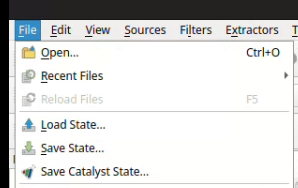
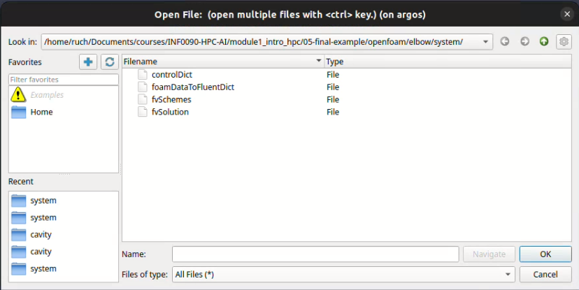
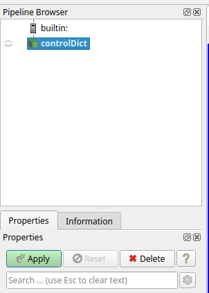
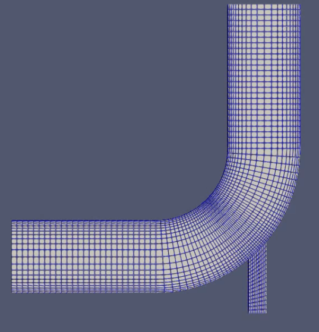
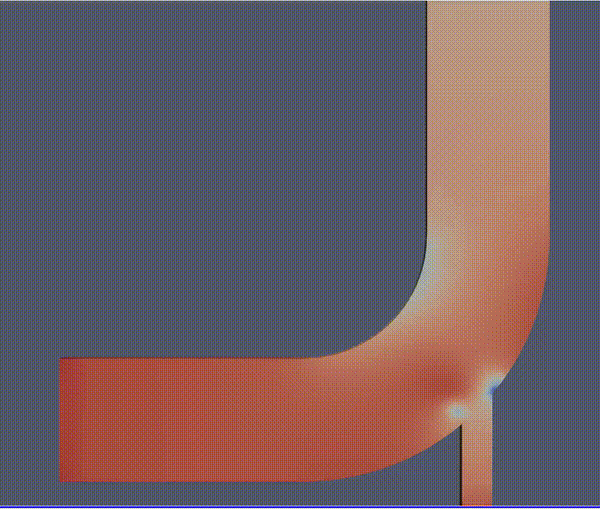

# Putting it All Together: Real-World Scientific Computing with OpenFOAM on HPC

This guide provides a complete, step-by-step walkthrough for executing **OpenFOAM** (Open-source Field Operation And Manipulation), a leading open-source computational fluid dynamics (CFD) package, on an HPC cluster using containerized environments and SLURM job scheduling.

### What You'll Learn

This tutorial covers the complete workflow for real-world CFD simulations:
- **Container Setup:** Building and managing containerized OpenFOAM environments
- **Problem Definition:** Setting up CFD case files (mesh, boundary conditions, solver settings)
- **Cluster Execution:** Submitting SLURM jobs with proper resource allocation
- **Results Analysis:** Post-processing and visualizing results with ParaView

### Reference Case: Incompressible Flow in an Elbow Junction

We use the classic **elbow pipe case** (incompressible flow in a pipe bend) as our working example. This is a classic CFD benchmark that demonstrates:
- Mesh generation and refinement
- Parallel computation across multiple cores
- Time-dependent flow simulation
- Visualization of velocity and pressure fields


## Step 1: Container Setup

### 1.1 Download and build the OpenFOAM container image

OpenFOAM can be installed and run on various platforms, but using a containerized environment ensures consistency and reproducibility across different HPC systems. We will use **Apptainer** to create a container image that includes OpenFOAM and all necessary dependencies. Pull the pre-built OpenFOAM image from Docker Hub and convert it to Apptainer format:

```bash
apptainer build openfoam.sif docker://openfoam/openfoam6-paraview54
```
It may take a few minutes to download the image and build the container. Once the process is complete, you should have an `openfoam.sif` file in your current directory, which is the Apptainer image containing OpenFOAM.

### 1.2 Verify Container Installation

You can verify that the container is working correctly by running a simple OpenFOAM utility. For example, you can check the help message for the `icoFoam` solver:

```bash
srun --pty -p cpu apptainer run openfoam.sif 
iconFoam -help

# Or in a single command:
srun -p cpu apptainer exec openfoam.sif bash -c "source /opt/openfoam6/etc/bashrc && icoFoam -help"
```

It should display the usage information for the `icoFoam` solver, confirming that OpenFOAM is properly installed and accessible within the container.

```
Usage: icoFoam [OPTIONS]
options:
  -case <dir>       specify alternate case directory, default is the cwd
  -fileHandler <handler>
                    override the fileHandler
  -hostRoots <(((host1 dir1) .. (hostN dirN))>
                    slave root directories (per host) for distributed running
  -listFunctionObjects
                    List functionObjects
  -listRegisteredSwitches
                    List switches registered for run-time modification
  -listScalarBCs    List scalar field boundary conditions (fvPatchField<scalar>)
  -listSwitches     List switches declared in libraries but not set in
                    etc/controlDict
  -listUnsetSwitches
                    List switches declared in libraries but not set in
                    etc/controlDict
  -listVectorBCs    List vector field boundary conditions (fvPatchField<vector>)
  -noFunctionObjects
                    do not execute functionObjects
  -parallel         run in parallel
  -roots <(dir1 .. dirN)>
                    slave root directories for distributed running
  -srcDoc           display source code in browser
  -doc              display application documentation in browser
  -help             print the usage

Using: OpenFOAM-6 (see www.OpenFOAM.org)
Build: 6-d3fd147e6c65

```

## Step 2: Problem Setup and Mesh Preparation

### 2.1 Understand the Case Structure

OpenFOAM does not use a monolithic file database; instead, it relies on a strict, nested directory structure. The solver expects specific files in exact locations. If a single file is misplaced, your SLURM job will fail instantly.

Here is the architectural layout for our parallelized elbow case:
```
elbow/
├── 0/                    # Initial and boundary conditions
│   ├── U                 # Velocity field
│   ├── p                 # Pressure field
│   └── epsilon, k, etc.  # Turbulence model fields
├── constant/             # Physical properties and mesh
│   ├── polyMesh/         # Mesh definition (faces, cells, points)
│   ├── transportProperties
│   ├── RASProperties
│   └── fvSchemes
├── system/               # Solver configuration and I/O
│   ├── controlDict       # Simulation time settings
│   ├── fvSchemes         # Discretization schemes
│   ├── fvSolution        # Linear solver settings
│   └── decomposeParDict  # Domain decomposition (for parallel runs)
└── constant/polyMesh/    # Generated mesh files
```

### 2.2 Mesh Generation and Conversion

For this test case, we have also included two pre-generated mesh files (`.msh` format) created using Gmsh (an open-source 3D finite element mesh generator). These meshes represent the same geometry but with different resolutions and element types:
  
 - `elbow_tri.msh` (Triangular Elements): A coarser, unstructured mesh. It has fewer cells, meaning it runs significantly faster and uses less memory, making it ideal for rapid debugging.
 - `elbow_quad.msh` (Quadrilateral Elements): A finer, structured mesh. It provides much higher geometric accuracy and better alignment with the fluid flow direction, but requires more computational power.

Before OpenFOAM can solve the Navier-Stokes equations on these grids, the external Gmsh geometry must be translated into OpenFOAM’s native `polyMesh` format. We will use the containerized `gmshToFoam` utility to parse the grid topology and map the physical boundary patches:

```bash
srun -p cpu apptainer exec openfoam.sif bash -c "source /opt/openfoam6/etc/bashrc && fluentMeshToFoam -case elbow elbow_quad.msh" 
```
### 2.3 Verify Mesh Integrity

Once the conversion completes, look inside your `elbow/constant/polyMesh/` directory. You will see that it has been populated with five core text files:  `boundary`, `faces`, `neighbour`, `owner`, and `points`. The `boundary` file describes the physical boundaries of the domain, while `faces`, `neighbour`, `owner`, and `points` define the connectivity and spatial coordinates of the mesh. 

Before submitting a job to the SLURM queue, you must audit this newly generated grid using `checkMesh`. Running calculations on highly skewed or non-orthogonal cells will cause the linear matrix solvers to blow up, wasting valuable cluster hours.

```bash
# Check the mesh
srun -p cpu apptainer exec openfoam.sif  bash -c "source /opt/openfoam6/etc/bashrc && checkMesh -case elbow"
```

Scroll to the bottom of the terminal output and look for this crucial verification block:

```txt
...
Mesh stats
    points:           4678
    internal points:  0
    faces:            8938
    internal faces:   4262
    cells:            2200
    faces per cell:   6
    boundary patches: 5
    point zones:      0
    face zones:       0
    cell zones:       0
... (additional mesh quality warnings may appear here) ...
Mesh OK.
```

**Note:** If `checkMesh` returns anything other than `Mesh OK` (such as severe non-orthogonality warnings), you must adjust your discretization schemes in `system/fvSchemes` to handle the grid instability, or regenerate the mesh entirely before scaling it out across multiple nodes.

### 2.4 Visualize the Mesh with ParaView

Before committing computational resources to a long production run, it is best practice to visually inspect the converted mesh. Because [ParaView](https://www.paraview.org/) requires a graphical user interface (GUI) that can lag over remote SSH connections, you should perform this step on your local machine. Follow these steps to open and inspect the mesh structure:

- **Launch ParaView** on your local machine
- **Open the Case File:** Click "File" → "Open" and navigate to the `elbow/system` directory



- **Select the Control Dictionary:** Change the "Files of type" dropdown to `All Files (*)`, select the `controlDict` file, and click Open. (OpenFOAM uses controlDict as the entry point for case geometry reader pipelines).



- **Initialize the Data Pipeline:** In the **Pipeline Browser** (left panel), ensure `controlDict` is highlighted. Move down to the **Properties Panel** (bottom-left) and click the green **Apply** button to load the geometry into memory.



- **Enable Grid Visibility:** By default, ParaView renders the geometry as a solid, flat-colored volume. To inspect the individual elements, locate the representation dropdown menu in the top toolbar and switch it from *Surface* to **Surface with Edges**.


- **Inspect the Grid Quality:** The 3D viewport will now display the converted mesh layout. Use your mouse to rotate, zoom, and pan around the pipe elbow bend. Check for smooth element transitions around the curve and verify that boundary surfaces are correctly defined.




## Step 3: Case Configuration

The execution behavior, timeline bounds, and output frequency of your simulation are governed by the `elbow/system/controlDict` dictionary. Before submitting your parallel job, you should audit these settings to ensure the computational load matches your allocated SLURM walltime.

To view the current configuration:

```bash
cat elbow/system/controlDict
```

**Key Parameter Breakdown**

The file is configured for a transient (time-dependent) simulation. Here are the active parameters you will find inside:

| Parameter | Current Value | HPC Engineering Function |
| --- | --- | --- |
| **`startTime`** | `0;` | The data directory from which the solver begins reading initial conditions. |
| **`endTime`** | `100;` | The total physical time (in seconds) the simulation will track. |
| **`deltaT`** | `0.05;` | The time-step increment ($\Delta t$). A smaller $\Delta t$ increases accuracy but demands more iterations. |
| **`writeControl`** | `runTime;` | Tells OpenFOAM to save data based on physical simulation time rather than clock time or step count. |
| **`writeInterval`** | `5;` | Saves full velocity ($U$) and pressure ($p$) matrix fields every 5 physical seconds. |


## Step 4: SLURM Job Submission

Since this run executes on a single CPU core, OpenFOAM will solve the full mesh matrix sequentially. We do not need to configure MPI libraries or handle split processor data directories.

### 4.1 Create the Slurm Submission Script

Create a new file named `run_openfoam_elbow.sh` in your root case directory:

```bash
#!/bin/bash
#SBATCH --job-name=openfoam_elbow
#SBATCH --partition=cpu
#SBATCH --nodes=1                 # Request 1 physical compute node
#SBATCH --ntasks=1                # Run strictly on 1 CPU core
#SBATCH --mem=4G                  # Allocate 4 GB of RAM
#SBATCH --output=openfoam_elbow.out   # Standard output log
#SBATCH --error=openfoam_elbow.err    # Standard error log

# Define container and directory variables
CASEDIR=$(pwd)/elbow

# Clean previous run 
for i in {1..100}; do [ -d "elbow/$i" ] && rm -rf "elbow/$i"; done

# Run the OpenFOAM solver inside the container
apptainer exec openfoam.sif bash -c "source /opt/openfoam6/etc/bashrc && icoFoam -case $CASEDIR"
```
This script requests a single node with one CPU core and 4 GB of RAM, which is sufficient for our sequential run. The `set -e` command ensures that if any step fails, the script will exit immediately, preventing wasted cluster time. The `apptainer exec` command runs the `icoFoam` solver within the container, sourcing the OpenFOAM environment before execution.

### 4.2 Submit and Track the Workload

Once your SLURM script is ready, submit it to the cluster:

```bash
sbatch run_openfoam_elbow.sh
```

Do not forget to monitor your job's status using:

```bash
squeue --me
```

While the status is **R** (Running), you can watch the linear equations solve step-by-step by checking the output log file:

```bash
tail -f openfoam_elbow.out
```


### 4.3 Verify Output Datasets

Once the job completes, the solver writes its calculated physical states directly to the case directory. Verify that your dataset folders were created successfully:

```bash
# List all newly generated time directory folders
ls -1 | grep "^[0-9]"
```

If the job ran successfully, you should see a series of time directories corresponding to the physical simulation time steps:

```txt
0     # Initial boundary conditions
5     # Solved physical data fields at t = 5s
10    # Solved physical data fields at t = 10s
...
100   # Final simulation data state at t = 100s
```

Because this was a sequential run, these folders contain the complete, unified data fields immediately. There is no need to run a reconstruction tool. Therefore, your data is fully compiled and ready to be downloaded to your local workstation for ParaView visualization.

## Step 5: Post-Processing and Visualization

Because OpenFOAM saves data as raw matrix text fields, we use ParaView to interpolate those fields into 3D visual graphics.

The INF0090 compute nodes do not possess graphical windows or hardware rendering pipelines for interactive interfaces. Therefore, the standard scientific computing workflow requires you to download from the cluster to your local graphics workstation for visualization.

### 5.1 Transfer Results to Local Machine

Open a terminal application on your local machine (not connected via SSH to the cluster) and use `scp` to download your entire data folder. Instead of downloading only a few individual files, transfer the entire case directory structure to preserve the necessary time step hierarchies:

```bash
# From your local machine:
mkdir openfoam_results
scp -r yourUsername@143.106.73.68:<path/to/elbow/> ./openfoam_results
```

### 5.2 Animate the transient Fluid Flow

Once the transfer completes, you can visualize the fluid dynamics across the 100-second timeline:

1. Launch **ParaView** on your workstation.
2. Click **File ➔ Open**, navigate to your newly downloaded `local_openfoam_results/system/` folder, select the `controlDict` file, and click **Open**.
3. In the left-hand **Properties Panel**, click the green **Apply** button to load the geometry mesh and data fields into the workspace.
4. Modify the active variable viewing field in the top toolbar from *Solid Color* to **U** to map the physical velocity magnitude across the mesh cells.
5. To observe the fluid behavior step-by-step through time, locate the animation toolbar at the top center of the application window and click the **Play** button.


The 3D viewport will cycle through your generated time directories sequentially, rendering the mixing fluid interface profiling across the pipe junction curve over time.




## Practice: Running the Complete Workflow using a different grid `elbow_tri.sh` 

Now that you have completed the simulation using the fine quadrilateral grid `(elbow_quad.msh`), your final practice is to replicate the process using the coarser triangular alternative: `elbow_tri.msh`. To make this execution efficient, we can combine the entire pre-processing and solving workflow into a single, automated SLURM script `run_elbow_complete_tri_mesh.sh`:

```bash
#!/bin/bash
#SBATCH --job-name=openfoam-elbow-tri
#SBATCH --partition=cpu
#SBATCH --nodes=1                # Single node
#SBATCH --ntasks=1               # 1 processor (core)
#SBATCH --mem=4G                 # 4 GB RAM
#SBATCH --output=openfoam_elbow_tri.out   
#SBATCH --error=openfoam_elbow_tri.err

CASEDIR=$(pwd)/elbow

echo "=========================================="
echo "OpenFOAM - Elbow Case - triangular grid"
echo "=========================================="

# Clean previous run 
for i in {1..100}; do [ -d "elbow/$i" ] && rm -rf "elbow/$i"; done

# Creating mesh for foam format
apptainer exec openfoam.sif bash -c "source /opt/openfoam6/etc/bashrc && fluentMeshToFoam -case $CASEDIR elbow_tri.msh" 

# Check mesh quality
apptainer exec openfoam.sif bash -c "source /opt/openfoam6/etc/bashrc && checkMesh -case $CASEDIR"

# Run simulation
apptainer exec openfoam.sif bash -c "source /opt/openfoam6/etc/bashrc && icoFoam -case $CASEDIR"
```

Submit this script with `sbatch run_elbow_complete_tri_mesh.sh` and it will execute the entire workflow for the triangular mesh. After completion, you can transfer the results and visualize them in ParaView to compare with the quadrilateral mesh results.


## Further Readings

- **Official Documentation:** https://www.openfoam.com/documentation
- **Tutorials:** https://cfd.direct/openfoam/user-guide/
- **Community Forum:** https://www.cfd-online.com/Forums/openfoam/
- **ParaView Guide:** https://www.paraview.org/Wiki/ParaView

**Congratulations!** You have successfully mastered deploying containerized scientific packages, managing cluster workloads, and generating production-level transient simulations on high-performance computing infrastructure.